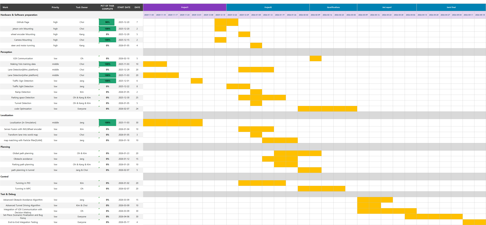

# 🚗 Project Overview

This document presents the overall project plan, including the software stack, hardware configuration, perception and localization pipeline, and planning and control modules.

---

## 🧩 Software Stack

- **Python**
- **C++**
- **ROS 2 Humble**

> The system is implemented using a modular ROS 2 architecture to enable real-time processing and efficient inter-node communication.

---

## 🛠 Hardware Configuration

### 📡 Sensors & Computing Unit

| Component | Description |
|---------|------------|
| **Intel RealSense D455f** | Depth Camera |
| **AMT103-V** | Wheel Encoder |
| **NVIDIA Jetson Orin Nano** | Embedded GPU Computing Unit |

---

### 🔍 Rationale for Hardware Selection

#### ⚙ AMT103-V Wheel Encoder
The AMT103-V wheel encoder measures wheel rotation to estimate the vehicle’s **longitudinal velocity**.

Relying solely on IMU data leads to **accumulated drift** over time.  
By fusing **wheel encoder** and **IMU** measurements, the system achieves more accurate velocity estimation and a more stable vehicle pose.

---

#### 📷 Intel RealSense D455f (Depth Camera)
As the vehicle is not equipped with a LiDAR sensor, laser-based distance measurement is unavailable.  
Instead, a **depth camera** is used to obtain per-pixel distance information, enabling:

- Obstacle distance estimation  
- Spatial perception of the environment  

The RealSense D455f provides sufficient depth range and accuracy for **indoor track environments**.

---

#### 🧠 NVIDIA Jetson Orin Nano
Object detection is performed using deep learning–based models such as **YOLO**.

Compared to the Raspberry Pi 5, the Jetson Orin Nano offers significantly higher GPU performance, making it well suited for:

- Real-time inference  
- Parallel execution of multiple ROS 2 nodes  

This ensures stable performance under computationally demanding workloads.

---

## 👁 Perception & Localization

### 🛣 Lane Detection
- Inverse Perspective Mapping (**IPM**)  
- Canny Edge Detection  

Lane features are extracted in a **Bird’s-Eye View (BEV)** representation to improve robustness and geometric consistency.

---

### 🚦 Object Detection
- Traffic sign detection  
- Obstacle detection  

The **YOLO** algorithm is used for object detection, with the model selected and optimized for **real-time inference** in the competition environment.

In addition, **HSV color-space filtering** is applied to distinguish traffic light colors, improving robustness under varying lighting conditions.

---

### 📍 Localization

#### 🔗 Sensor Fusion with EKF
- Wheel encoder  
- IMU  

An **Extended Kalman Filter (EKF)** fuses motion-related sensor data to estimate the vehicle’s pose.

> ⚠️ GPS data is **not available** in the final competition environment.  
> Therefore, localization relies entirely on onboard sensors.

---

#### 🎯 Particle Filter–Based Localization
1. An initial pose is estimated using EKF  
2. Particles are generated around the EKF-estimated pose  
3. Detected lane features in BEV are compared with a **pre-mapped lane map**  
4. Particle weights are computed and resampling is performed iteratively  
5. The particle distribution converges to the most likely vehicle position  

By combining **motion-based estimation (EKF)** with  
**map-based correction (Particle Filter)**, the system achieves accurate localization without GPS.

---

## 🧭 Planning & Control

- Global path planning  
- Local path planning  
- **Model Predictive Control (MPC)**  

MPC computes optimal control inputs while considering vehicle dynamics, enabling accurate and smooth trajectory tracking.

---

## 📅 Project Timeline

  

**Figure X.** Task-level project timeline aligned with competition milestones.
